# be home barista 

  
    

      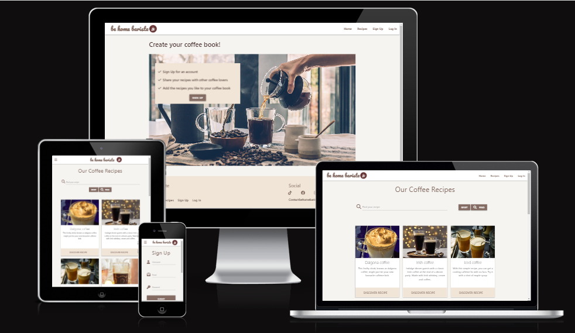
    

Whether you prefer your coffee black or with a little more milk and sugar, there are so many ways to prepare it that you can’t help but fall in love with this flavourable beverage all over again.
Be home barista is a web application developed for coffee lovers as well as for all occasional coffee drinkes that would like to share their coffee experience and delicious recipes online.  
It also provides a great opportunity for coffee drinkers to share their local recipes with others from around the world.
This application makes it easy for users to create and save their coffee-recipes online, as well as search for recipes and save them in their profile (coffee book).
Be home barista was designed with a user experience in mind and provides the functionalities a coffee-recipe sharing web application should have. Users benefit from having convenient access to the data provided by all other app members.

## User Experience (UX)

### User Stories 

New User / non-registered 
 
- As a user, I would like to understand the purpose of the website and what the website offers.
- As a user, I would like to use the website and see the content clearly on any device.
- As a user, I would like to be able to easily navigate through the website.
- As a user, I would like to search for recipes.
- As a user, I would like to explore all shared recipes .
- As a user, I would like to see a full recipe version without having to register.
- As a user, I would like to have an option to sign up and create my own coffee book.
- As a user, I would like to navigate intuitively and spot the Sign-Up button and all other important links right away.
- As s user, I would like to find contact details in case I need to aproach a website creator.

Returning User
- As a user, I would like to easily spot a Log In button. 
- As a user, I would like to easily navigate to my profile and other pages available to me.
- As a user, I would like to be able to create and share my recipes with other users.
- As a user, I would like to edit recipes I have created.
- As a user, I would like to delete recipes I have created.
- As a user, I would like to save my favourite recipes to my profile.
- As a user, I would like to have an option to remove the saved recipes from my coffee book.

Admin
- As an admin, I would like to edit existing recipes created by any user.
- As an admin, I would like to delete existing recipes created by any user.
- As an admin, I would like to remove any inappropriate or other offensive content shared in a user recipe.
- As an admin, I would like to have an option to create, edit or delete a category.

### Implementation 

- Used a layout with a coffee background image and coffee theme colours as well as an initial message to give users an 
  early sense of what the website is about.
- Made the website responsive, visible and easy to read on desktops, laptops, tablets and smartphones.
- Implement a search bar for a user to find a recipe based on name, ingredients and recipe intro.
- For registered users, a profile page has been created with two tabs - for recipes they created themselves and recipes
  they added to their favourites.
- If a user has created/added a recipe, two additional buttons appear on a full recipe page for them to modify or delete 
  their recipes if they wish.
- Registered users are also provided with an extra Add/remove favourites button so they can add the recipes they like to
  their coffee book.
- Users can find an email address in footer section if they wish to contact admin.
- The same layout and navigation bar/footer are used throughout the whole website for effective manipulation.
- Sign Up and Log In buttons are easy to spot and Sign Up process is very simple and straightforward.
- Adding and editing recipies are very simple as well. When editing a recipe all fields are populated with your original
  input so it is easy to make changes. 
- Even for users who do not intend to sign up, this website could be helpful and informative.

### Existing Features

- __Home Page__

  
    

      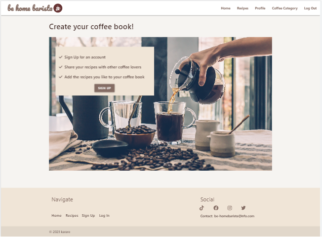
    

   

- The home page is the screen the end user is presented with on page load.  
  All webpages have the same gray-colour background with white navigation bar and pale brown footer. Two colors have been used for fonts: brown and blue. The whole project is using warm brownish (coffee) design to fit the purpose of the website.

  Base.html template has been used as a parent template; it includes the basic html structure with all important links for frameworks and libraries needed for the website to function properly. 
  The parent template also includes the navigation bar and footer that are consistent across all web pages.
  This support the intuitiveness of the entire website and enhances the user experience and makes the website easy to use.
  
  Home Page includes a theme picture that fits the overall layout of the website. This coffee image has been used to attract potential users and give them a hint on what the website is about. The aim is also to make the website useful and interesting for the users that are already signed up to come back and share their new delicious coffee recipes. 
  The home page also contains a message attached to the background image that explains why a user should register and the benefits they receive.
  The main purposure of this website is to share coffee recipies but it also gives sign-up users the opportunity to create their own online coffee book - and save the recipes they like. 
  Overall the Home page has been created to give a pleasant first impression and encourage a new visitors to click on sign up button and contribute with their coffee recipes.

      
    

      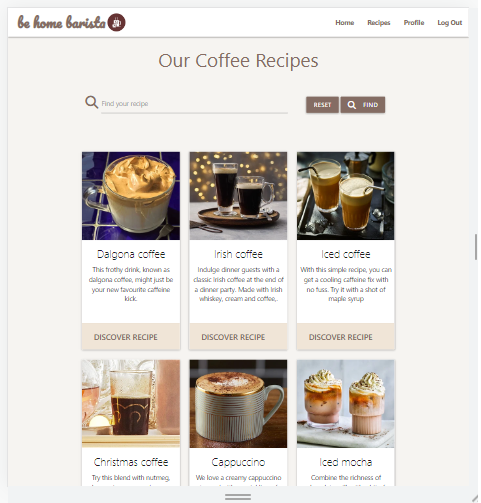
    

- __Recipe Page__

- On the Recipe page, a user can find any recipes shared by others or themselves. They also have the opportunity
  to search for a recipe if they are looking for a particular recipe or ingredients. 
  The website mostly consists of recipe cards with an image and a brief recipe description (recipe intro).
  If one of the shared recipes catches users' attention, they can click the Discover Recipes button on the bottom of the recipe card and open the entire recipe.
  The full recipe page includes all the details and instructions necessary to prepare a coffee drink, such as:
  recipe name, recipe brief description, preparation time and serving information as well as difficulty, and two most important sections - ingredients and method.
  It also shows a creator's username, category and a recipe image. 
  Overall the full-recipe is divided into 4 sections for bettter readability and user experience. In the ingredients section, every single ingredient is underlined and every step in the method section in numbered.
  Preparation time, difficulty and serves also have Icon prefixes for a better UX and layout.

      
    

      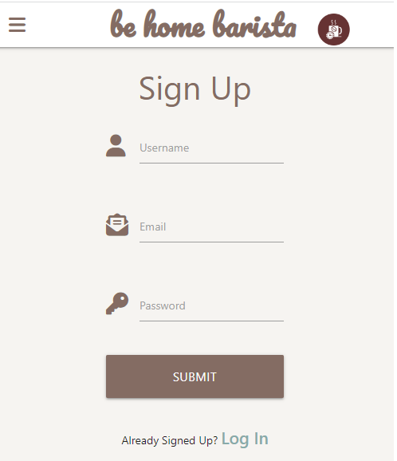
    

 __Sign Up / Log In Page__
- Signing Up to the website is very simple and straightforward. The aim was to keep it as simple as possible for users
  not to get discouraged by tedious registration process.
  Sign Up form includes Icon Prefixes for a better user experience and layout.
  All three fields: username, email and password need to be input in order to sign up.
  There are some restrictions when creating a username and password; username needs to have a minimum of 5 and maximum of 20 characters - all alphanumeric without spaces. Password needs to be at least 8 characters long and maximum of 20 - all alphanumeric and without spaces. 
  If a user input the correct details into the sign up form and the inputed username does not already exists, then they will be informed, they have been succesfully registered. Otherwise they will get a message asking them to fill in the form again. 
  All three fields have validation applied so if username, password or email do not meet criteria for signing up, red underline will appear. Green underline will indicate that all fields have been filled in correctly and the form is ready for submission. 
  Werkzeug "generate_password_hash" and "check_password_hash" method has been used for converting a user's password. 

  Log In Page includes two input fields that need to be filled in by a registered user in order to Log-In.
  Again, both have validation applied and will indicate if the criteria have been met. If the correct username and password have been used and they match the details on mongodb, a flash message will inform the user that they have been successfully logged in, otherwise a message will prompt the user to input the correct log-in details. 

   
    

      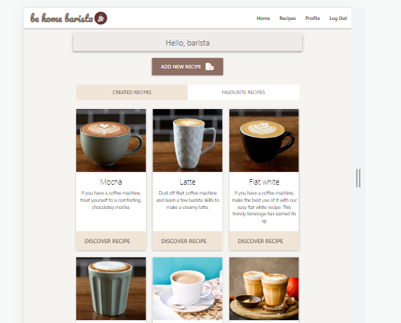
    

 __Profile Page__

 Profile Page is only available for registered users; here they can create their own coffee book. 
 It consists of a personalized greeting with a welcome message, 'Add new recipe' button to encourage a registered user to add a new recipe and share it with the coffee community as well as the most important part: tabs for created recipes and favourite recipes. In 'created recipes' tab are stored all recipies that the user has added and shared on the website. In 'favourite recipes' tab are stored all recipies saved to the coffeebook by the logged-in user. All created recipes can be edit or deleted and all favourite recipies can be removed from favouries and add to favouries again, if a user wish to. If no recipes created or added to favourites, messages will be displayed to prompt a user to create or save recipes. 
 A logged-in user can create their personalized coffee book that contains both their own recipes as well as recipes they discover and like while searching on recipes page. 
 
  
    

      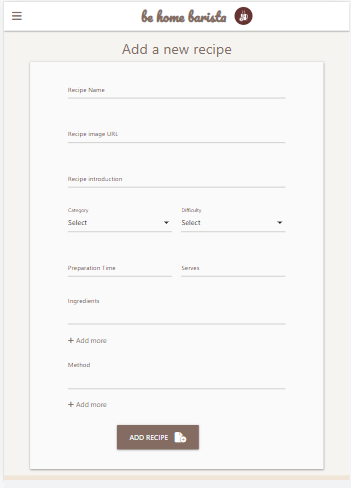
    

__Adding and Editing Recipes Page__

'Add recipe' form will appear on screen once clicked on 'Add new recipe' button in the profile page.
Again, the adding form is simple and straightforward. It includes input fields for: recipe name, recipe image url, category, difficulty, preparation time, serves and the most important input fields: ingredients and method. 
Ingredients and method have a button to add extra fields to input ingredients or step of preparation separately in new lines (or paragraphs). All fields are required to fill in apart from recipe image url; if the recipe image url is not provided, a general image will be displayed instead.
All fields have validation applied or pre-populated format make it easy for a user to fill in the form and provide a correct details. 

'Edit recipe' form will appear on screen if a user click the 'Edit' button on full recipe page. All original input will be retrieved in input fields for better and more effective editing. If a user does not want to proceed and change the recipe, they can click on 'Cancel' button to go back to full recipe. If a user want to delete the recipe they created, they will click on 'Delete' button and a confirmation pop-up block will be displayed to verify if they would like to proceed with an action.

   
    

      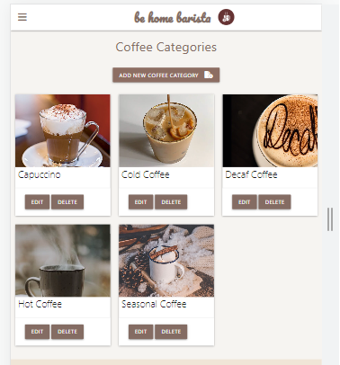
    

__Coffee Category Page__
Coffee Category is displayed only for an admin and provides them with an option to create, edit or delete a category. An admin also have access to edit and delete all recipes on website in case of any inappropriate or offensive content has been shared. Coffee category page includes a category cards with an image and 'Edit' as well as 'Delete' buttons. It has a 'Add coffee category' button that will redirect an admin to 'Add coffee category' form. 
'Add coffee category' form has two input fields for a category name and category image url, but the latter one is optional. When clicking on 'Edit' button, 'Edit coffee category' form will appear on the screen with the original input for simple and effective editing. If an admin does not want to modify the category, they have an option to click on 'Cancel' button and return to 'Coffee Category' page.

### Features Left to Implement

  - implement users comments for recipes;  users can share their experience
  - promote some items on the website e.g. new coffee brands or coffee machines
  

## Testing 

Manual Testing of implemented features:   

 - HOME PAGE Testing

| **Feature** | **Action** | **Expected Result** | **Actual Result** |
|-------------|------------|---------------------|-------------------|
| LOGO link  | Click on Logo | It will redirect a user from any page back to the Home page | Works as expected |
| NAV BAR - HOME | Click on Home | It will redirect a user from any page back to the Home page | Works as expected |
| NAV BAR - RECIPES| Click on Recipes| It will redirect a user from any page to the Recipes page and it is available even for non-registered users| Works as expected |
 | NAV BAR - SIGN UP| Click on Sign Up| It will redirect a user to the Sign Up form and it is available for all users| Works as expected |
 | NAV BAR - LOG IN| Click on Log In| It will redirect a user to the Log In form and it is available for all users| Works as expected |
 | NAV BAR - PROFILE|Click on Profile |Profile is available only for registed users, once registered, clicking on it will redirect a registered user to the Profile page from any other page | Works as expected |
 | NAV BAR - LOG OUT|Click on Log out |Log out is available only for logged-in users, once logged in, clicking on it will log out the user from their account and redirect them to Log In page| Works as expected |
 | NAV BAR - COFFEE CATEGORIES|Click on Coffee Categories |It is available only to admin, and will redirect the admin from any other page to Coffee Categories| Works as expected |
 | FOOTER - HOME link|Click on Home link|It will redirect a user from any page back to the Home page and if on Home page it will take a user back to the top of the page| Works as expected |
 | FOOTER - RECIPES link|Click on Recipes link|It will redirect a user from any page to the Recipes page and if on Recipe page it will take a user back to the top of the page| Works as expected |
 | FOOTER -  SIGN UP link|Click on Sign Up link|It will redirect a user from any page to the Sign Up page and if on Sign Up page it will take a user back to the top of the page| Works as expected |
 | FOOTER -  LOG IN link|Click on Log In link|It will redirect a user from any page to the Log In page and if on Log In page it will take a user back to the top of the page| Works as expected |
| FOOTER -  TikTok link|Click on TikTok link|It will open a new window with TikTok website| Works as expected |
| FOOTER -  FACEBOOK link|Click on FACEBOOK link|It will open a new window with Facebook website| Works as expected |
| FOOTER -  INSTAGRAM link|Click on Instagram link|It will open a new window with Instagram website| Works as expected |
| FOOTER -  TWITTER link|Click on Twitter link|It will open a new window with Twitter website| Works as expected |
| SIGN UP button|Click on Sign Up button|It will redirect a user to a Sign Up page | Works as expected |
   

- SIGN UP Page Testing

| **Feature** | **Action** | **Expected Result** | **Actual Result** |
|-------------|------------|---------------------|-------------------|
| USERNAME  | Input a username | Username needs to have min.5 and max.20 characters, no spaces and must be unique, if the same username already exists, a flash message will prompt the user to create another username. It is a required field, validation and pattern applied | Works as expected |
| EMAIL ADDRESS | Input an email address | It is required, validation and email pattern applied | Works as expected |
| PASSWORD | Input a password | Password needs to have min.8 and max.20 characters, no spaces. It is a required field, validation and pattern applied | Works as expected |
| SUBMIT button| Click on Submit button| If all input fields are filled in correctly, a flash message will appear to confirm the registration and a user will be redirected to their profile page, otherwise they will be prompted to complete a form again.| Works as expected |
| LOG IN link | Click on the link| If a user is already registered, they will click on Log in link to get to the Log in page  | Works as expected |
   

- LOG IN  Page Testing

| **Feature** | **Action** | **Expected Result** | **Actual Result** |
|-------------|------------|---------------------|-------------------|
| USERNAME / PASSWORD | Input username / password | A user needs to input their username and password that meet all requirements  | Works as expected |
| LOG IN button| Click on Log In button| If both username and password are correct, a flash message will confirm they are logged in and a user will be redirected to their profile page. Otherwise, a flash message will prompt a user to input the correct details | Works as expected |
| SIGN UP link | Click on the link| If a user is not registered yet, they will click on the Sign Up link to get to the Sign Up page   | Works as expected |
   

- RECIPE PAGE Testing

| **Feature** | **Action** | **Expected Result** | **Actual Result** |
|-------------|------------|---------------------|-------------------|
| SEARCH bar  | Input text into the Search bar | Validation applied; minlength 3 characters, if no input or less then 3 characters - red undelined | Works as expected |
| RESET (Search) button | Click on Reset button| It will remove all input from the Search bar and revert the bar into the initial position | Works as expected |
| FIND (Search) button  | Input text into Search bar and click on 'Find' button | Input a key word from recipe name, intro or ingredients and it will find the searching recipes | Works as expected |
| DISCOVER RECIPE button | Click on Discover Recipe button | It will open a full recipe | Works as expected |
  

- FULL RECIPE PAGE Testing

| **Feature** | **Action** | **Expected Result** | **Actual Result** |
|-------------|------------|---------------------|-------------------|
| A user not logged in | Automatic feature | No buttons displayed (Edit, Delete, Favourites) if a user is not logged in | Works as expected |
| User logged in | Automatic feature| It will display edit and delete buttons for recipes created by the user and add/remove favourites button for other recipes  | Works as expected |
| Logged in as an admin | Automatic feature  | Both edit and delete  buttons for all recipes + add/remove favourites for recipes not created by admin | Works as expected |
| EDIT (recipe) button | Click on Edit button | It will populate the 'edit recipe' form with the original input | Works as expected |
| DELETE (recipe) button | Click on Delete button | It will display a message for a user to confirm they wish to delete a recipe  | Works as expected |
|CANCEL (confirmation) button | Click on Cancel button | It will redirect a user back to a full recipe  | Works as expected |
|DELETE (confirmation) button | Click on Delete button | It will delete a recipe (flash message) and redirect a user back to full recipe | Works as expected |
| ADD TO FAVOURITES button | Click on 'Add to favourites' button | It will send a copy of the recipe into a user's profile, button will change to 'Remove from favourites' | Works as expected |
| REMOVE FROM FAVOURITES button | Click on Remove from favourites button | It will remove a recipe from user's profile and button will change back to 'Add to favourites' | Works as expected |
  

- ADD RECIPE PAGE Testing

| **Feature** | **Action** | **Expected Result** | **Actual Result** |
|-------------|------------|---------------------|-------------------|
| ADD NEW RECIPE button  | Click on Add new recipe | It is in profile page and available only for registered users and redirect a user to 'Add a new recipe' form | Works as expected |
| RECIPE NAME  | Input text into 'recipe name' field | Validation applied; min.5 and max.40 characters, if no input or less then 5 characters - red undelined; it will not let a user to input more then 40 characters | Works as expected |
| RECIPE IMAGE URL  | Input url into the Recipe Image Url | It is optional to add Image URL, if not provided, alternative image will be displayed | Works as expected |
| RECIPE INTRODUCTION | Input text into the Recipe Introduction | This field is required, validation applied; min. 5 max.125 characters| Works as expected |
| CATEGORY | Dropdown selection | This field is required, validation applied| Works as expected |
| DIFFICULTY | Dropdown selection | This field is required, validation applied| Works as expected |
| PREPARATION TIME | Input text into Preparation Time | It is required, validation applied, max.15 characters | Works as expected |
| SERVES | Pick a number from options | It is required, validation applied, min.1 max.30 | Works as expected |
| INGREDIENTS | Input text into Ingredients | It is required to input at least one line, validation applied, min.5 max.200 characters; max.20 inputs allowed | Works as expected |
| METHOD | Input text into Method | It is required to input at least one line, validation applied, min.5 max.750 characters; max.20 inputs allowed | Works as expected |
| ADD RECIPE button  | Click on Add recipe | It will display a flash message that recipe has been successfully added, it will be automatically shared with others in 'recipes page' and also will appear in user's 'created recipes' tab | Works as expected |
  

- EDIT RECIPE PAGE Testing

| **Feature** | **Action** | **Expected Result** | **Actual Result** |
|-------------|------------|---------------------|-------------------|
| CANCEL button  | Click on cancel button | Once in 'Edit recipe form', if a user does not want to submit any changes, clicking on Cancel button, they will be redirected to their profile page  | Works as expected |
| EDIT YOUR RECIPE button  | Click on 'Edit your recipe' button | Clicking on the button, changes will be stored and the updated recipe version will be displayed in 'recipes' page as well as in user's profile. | Works as expected |

  
All original content has been checked - if retrieved properly - works as expected
 
All input fields validation and requirements - works as expected 
  

- PROFILE PAGE Testing

| **Feature** | **Action** | **Expected Result** | **Actual Result** |
|-------------|------------|---------------------|-------------------|
| GREETING | automatic feature | Once logged in, a user will see a flash message and a personalized greeting | Works as expected |
| TABS (CREATED/FAVOURITE RECIPES)  | click on the tabs | Clicking on 'created recipes' tab, all recipes created by the user will be displayed; clicking on 'favourite recipes' tab all saved favourite recipes will be displayed. If no recipies created or saved, message will appear to prompt the user to create or save recipes | Works as expected |
| ADD NEW RECIPE button  | Click on Add new recipe | It will redirect a user to 'Add a new recipe' form | Works as expected |
  

- COFFEE CATEGORY / ADD COFFEE CATEGORY / EDIT COFFEE CATEGORY PAGE Testing

| **Feature** | **Action** | **Expected Result** | **Actual Result** |
|-------------|------------|---------------------|-------------------|
| ADD NEW COFFEE CATEGORY button | click on the button | Only admin has access to 'Coffee Category' page. Clicking on the button, the admin will be redirected to 'Add coffee category' form | Works as expected |
| EDIT (CATEGORY) button  | click on the button |  It will populate 'edit coffee category' form with the original input| Works as expected |
| DELETE (CATEGORY) BUTTON  | Click on the button | It will display a message for an admin to confirm they wish to delete a recipe  | Works as expected |
|DELETE (confirmation) button | Click on the button | It will delete a category (flash message) and redirect an admin back to coffee category page| Works as expected |
| CATEGORY NAME  | Input text into category name field | Validation applied; min.4 and max.30 characters, if no input or less then 4 characters - red undelined; it will not let an admin to input more then 30 characters | Works as expected |
| CATEGORY IMAGE URL  | Input url into the Category Image Url | It is optional to add Image URL | Works as expected |
| ADD COFFEE CATEGORY button  | Click on the button | It will display flash message (confirmation)  and redirect an admin to 'coffee category' page. New category will be added on 'Coffee Category' page | Works as expected |
| EDIT COFFEE CATEGORY button  | Click on the button | It will display flash message (confirmation) about update and redirect an admin to 'Coffee Category' page. The updated category will be displayed on 'Coffee Category' Page | Works as expected |

  
All original content has been checked - if retrieved properly - works as expected
 
All input fields validation and requirements - works as expected 

### Validator Testing 

- HTML
  The W3C Validator has been used to validate the HTML of the website.  
  All errors have been corrected.  
  [W3C validator](https://validator.w3.org/nu/?doc=https%3A%2F%2Fcoffee-book-project.herokuapp.com)

- CSS
  The W3C Jigsaw Validator was used to validate the CSS of the website.  
  No errors detected.  
  [(Jigsaw) validator](https://jigsaw.w3.org/css-validator/validator)
   [(Jigsaw) validator result](static/testing/CSS-validator.png)

- CI Python Linter was used as a Python validator
  No errors detected
  [CI Python Linter](static/testing/cl_python_linter.png)

- JSHint Services were used to validate Javascript  
   No errors detected 
  [script.js](static/testing/js-valid.png)  
  

- The WAVE Web Accessibility Evaluation Tool was used to check accessibility of the website:  
  One error had been detected - it is a nav bar code from materialize that includes an empty link 
  [Wave Web report](static/testing/wave-evaluation.png)

- Lighthouse reports:   
  [Lighthouse report Home](static/testing/lighthouse-home.png)  
  [Lighthouse report Recipes](static/testing/lighthouse-recipe.png)  
  [Lighthouse report Log In](static/testing/lighthouse-login.png)  
  [Lighthouse report Sign Up](static/testing/lighthouse-signup.png)  
  [Lighthouse report Add recipe](static/testing/lighthouse-add-recipe.png)  
  [Lighthouse report Add category](static/testing/lighthouse-add-category.png)  
  [Lighthouse report Edit recipe](static/testing/lighthouse-edit-recipe.png)  
  [Lighthouse report Edit category](static/testing/lighthouse-edit-category.png)  
  [Lighthouse report Full recipe](static/testing/lighthouse-full-recipe.png)  
  [Lighthouse report Category](static/testing/lighthouse-category.png)  

- Further testing has been done with Chrome DevTools, making sure that responsiveness works correctly on all devices.
  After the deployment, I tested the website link focusing on website functionality and CRUD operations and if all important features work as expected. No issues were detected. 

- The website was assessed in various browsers: Mozilla Firefox, Google Chrome and Microsoft Edge.
  Live link was tested on Huawei P30, Samsung A50 to test smaller screen sizes, on a small display laptop - HP ProBook 430 and also on a larger display laptop - Dell Latitude 5580.  
  Each of the pages functioned well.

### Fixed Bugs
- Recipes in favourites did not display the content and showed blank - the issue has been resoved by converting array into strings. 

### Unfixed Bugs
There is an issue with Favicon, sometimes not displaying properly. Last time I resolved it by adding the crossorigin attribute.
However, it seems to be another isssue this time. 

### Wireframes 
- [Home Desktop](static/wireframes/Home_Desktop.png)
- [Home Tablet](static/wireframes/Home_Laptop.png)
- [Home Mobile](static/wireframes/Home_Mobile.png)
- [Recipes Desktop](static/wireframes/Recipes_Desktop.png)
- [Recipes Laptop](static/wireframes/Recipes_Laptop.png)
- [Recipes Mobile](static/wireframes/Recipes_Mobile.png)
- [Sign Up Desktop](static/wireframes/Sign_Up_Desktop.png)
- [Sign Up Laptop](static/wireframes/Sign_Up_Laptop.png)
- [Sign Up Mobile](static/wireframes/Sign_Up_Mobile.png)
- [Log In Desktop](static/wireframes/Log_In_Desktop.png)
- [Log In Laptop](static/wireframes/Log_In_Laptop.png)
- [Log In Mobile](static/wireframes/Log_In_Mobile.png)
- [Profile Desktop](static/wireframes/Profile_Desktop.png)
- [Profile Laptop](static/wireframes/Profile_Laptop.png)
- [Profile Mobile](static/wireframes/Profile_Mobile.png)
- [Add Recipe Desktop](static/wireframes/Add_Recipe_Desktop.png)
- [Add Recipe Laptop](static/wireframes/Add_Recipe_Laptop.png)
- [Add Recipe Mobile](static/wireframes/Add_Recipe_Mobile.png)
- [Edit Recipe Desktop](static/wireframes/Edit_Recipe_Desktop.png)
- [Edit Recipe Laptop](static/wireframes/Edit_Recipe_Laptop.png)
- [Edit Recipe Mobile](static/wireframes/Edit_Recipe_Mobile.png)
- [Full Recipe Desktop](static/wireframes/Full_Recipe_Desktop.png)
- [Full Recipe Laptop](static/wireframes/Full_Recipe_Laptop.png)
- [Full Recipe Mobile](static/wireframes/Full_Recipe_Mobile.png)
- [Categories Desktop](static/wireframes/Categories_Desktop.png)
- [Categories Laptop](static/wireframes/Categories_Laptop.png)
- [Categories Mobile](static/wireframes/Categories_Mobile.png)
- [Add Category Desktop](static/wireframes/Add_Category_Desktop.png)
- [Add Category Laptop](static/wireframes/Add_Category_Laptop.png)
- [Add Category Mobile](static/wireframes/Add_Category_Mobile.png)
- [Edit Category Desktop](static/wireframes/Edit_Category_Desktop.png)
- [Edit Category Laptop](static/wireframes/Edit_Category_Laptop.png)
- [Edit Category Mobile](static/wireframes/Edit_Category_Mobile.png)

  ## Technologies Used 
- [HTML](https://en.wikipedia.org/wiki/HTML)
- [CSS](https://en.wikipedia.org/wiki/CSS)
- [Javascript](https://en.wikipedia.org/wiki/JavaScript)
- [Python](https://www.python.org/)

Also made use of:
- [jQuery 3.6.3](https://jquery.com/)
- [Materialize CSS](https://materializecss.com/) responsive front-end framework
- [Flask](https://flask.palletsprojects.com/en/2.2.x/)
- [Jinja](https://jinja.palletsprojects.com/en/3.1.x/)
- [Werkzeug](https://werkzeug.palletsprojects.com/en/2.2.x/)
- [pymongo](https://pypi.org/project/pymongo/)
- [Font Awesome](https://fontawesome.com/)
- [favicon.io](https://favicon.io/favicon-generator/)
- [HTML Validator](https://validator.w3.org/)
- [CSS Validator](https://jigsaw.w3.org/css-validator/)
- [Javascript Validator](https://jshint.com/)
- [Chrome DevTools](https://developer.chrome.com/docs/devtools/open/)
- [Balsamiq](https://en.wikipedia.org/wiki/Balsamiq)

Database Management
- [MongoDB](https://www.mongodb.com/)
  MongoDB was used as an open source database to store the data for the application.
  
   
  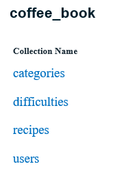
  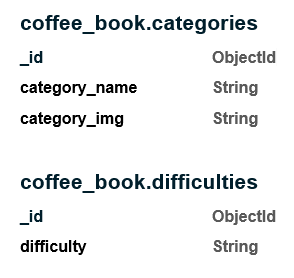
  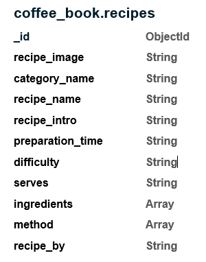
  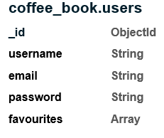

## Deployment
  For this project, I have used Gitpod as the IDE and the repository has been stored on GitHub. 
  The web application has been deployed on Heroku.
- There are two ways how to deploy an app on Heroku:   
  a) Using Heroku command-line interface (CLI) /Heroku toolbelt
  b) Setting up automatic deployments from GitHub
  For this project,  the second option - Automatic Deployment - from my GitHub repository has been used:

- Setting up automatic deployments from GitHub:  
  1) Create an account on Heroku and once signed up click on the "Create New App" button.
       The app name must be unique - something that nobody else currently has and without spaces (use dash or minus instead of spaces) and all lowercase letters.
       Then select a region closest to you. 
  2) Go to Heroku 'Settings' Tab, click 'Reveal Config Vars' and input the following variables (do not include any quotes): 
        | **KEY** | **VALUE** | 
        |-------------|------------|  
        |IP  | 0.0.0.0 |
        |PORT  | 5000 |
        |SECRET_KEY | your_secret_key|
        |MONGO_URI | mongodb+srv://coffee:<password>@cluster3.jhm4r33.mongodb.net/?retryWrites=true&w=majority
        |MONGO_DBNAME |	<database_name>|
  3) Go to Gitpod workspace and create a 'requirements.txt' file, which will install the dependencies 
        for the project, and tell Heroku that Python language is using.
        To create a requirements.txt file, type the following command in the terminal:  
        <strong>pip3 freeze --local > requirements.txt</strong>
        Then Add, commit and push the file into Github:
        + git add -A or git add requirements.txt
        + git commit -m "Add requirements.txt".
        + git push 
  4) Create a Procfile. The Procfile tells Heroku how to run the application.
     To create Procfile, type the following command in the terminal: 
     <strong>echo web: python app.py > Procfile</strong>
     Then Add, commit and push the file into GitHub:
     + git add -A or git add Procfile
     + git commit -m "Add Procfile".
     + git push 
  5) Make sure all your code is pushed to your GitHub repository.
     + git add -A 
     + git commit -m "insert your message here"
     + git push 
  6) Go to the Heroku Deploy Tab and click 'GitHub (Connect to GitHub)' for 'Deployment Method'
  7) Make sure your GitHub profile is displayed, then provide your Github repository name and then click Search.
     Once it finds your repository, click to 'Connect' to this app.
  8) Click 'Enable Automatic Deploys'
  9) Choose a branch to deploy 'main' and then click 'Deploy Branch' on Heroku
  10) You will see a message: "Your app has been succesfully deployed"
      Click 'View' to lauch your new app.

  My deployed app:  
    https://coffee-book-project.herokuapp.com/
  

## Credits 

- Code Institute's video on Task Manager App was used as the main reference point to set up a project using MongoDB, 
  flask, and jinja template, also build the core CRUD (Create, Read, Update, and Delete) functionalities in this project.
  [Code Institute Task Manager](https://learn.codeinstitute.net/courses/course-v1:CodeInstitute+NRDB_L5+2022_Q3/
  courseware/9e2f12f5584e48acb3c29e9b0d7cc4fe/054c3813e82e4195b5a4d8cd8a99ebaa/)

- Code for users to submit ingredients and method steps when creating a recipe was modified from Cookle Cookbook
  [github.com](https://github.com/dissyulina/cookle-cookbook)

- Search for ingredients(array) has been created with advice from Tutorial support.  

- Materialize was used for styling and responsivness
  [Materialize CSS](https://materializecss.com/)

### Content and Media

- Recipes and recipe images taken from:   
  [www.bbcgoodfood.com](https://www.bbcgoodfood.com/recipes/collection/coffee-recipes) 
- Background image on Home page taken from: 
  [www.pexels.com] (https://www.pexels.com/photo/beverage-breakfast-brewed-coffee-caffeine-374885/) 
  Photo by Burst 
- Alternative image with coffee beans 
- Background image on Home page taken from:  
  [pixabay.com](https://cdn.pixabay.com/photo/2022/04/11/16/29/coffee-beans-7126154_960_720.jpg) 
  Image by Jens from Pixabay (jensphotography)
- Category images taken from:   
  [www.pexels.com](https://www.pexels.com/photo/photo-of-coffee-mug-on-top-of-book-3216564/) 
  by lil artsy 
  [www.pexels.com](https://www.pexels.com/photo/brown-liquid-pouring-into-a-glass-8605853/) 
  Photo by solod_sha  
  [www.myrecipes.com](https://www.myrecipes.com/recipe/chocolate-cappuccino)  
  [pixabay.com] (https://pixabay.com/photos/winter-background-coffee-3876098/)  
  by Ylanite Koppens 
    
- Icons taken from: [Font Awesome](https://fontawesome.com/)
- Favicon taken from: [favicon.io](https://favicon.io/favicon-generator/)
- Logo created on Flaticon 
  [www.flaticon.com](https://www.flaticon.com/free-icons/coffee-time)
  Coffee time icons created by manshagraphics - Flaticon

